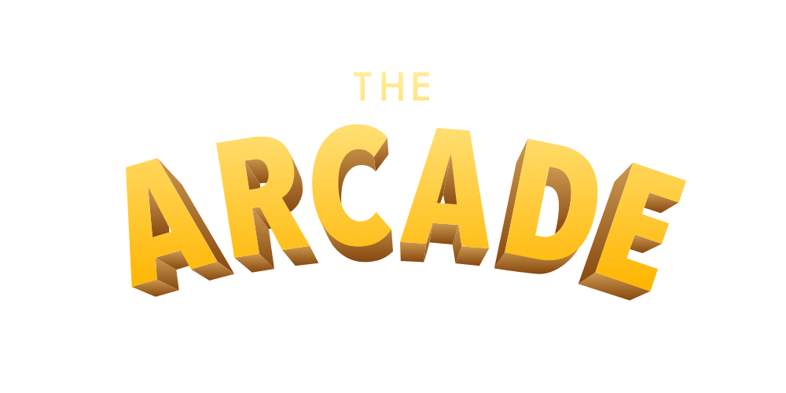

[The Arcade](https://arcade.motoroco.co) is a small collection of games you can play in your browser. The selection currently includes:

* [Spell that Pokémon!](https://arcade.motoroco.co/spell-that-pokemon)
* [Tetris](https://arcade.motoroco.co/tetris)
* [Snake](https://arcade.motoroco.co/snake)

## Run locally

You can run the Flask app directly for local development using virtualenv:

```sh
python3 -m venv ./.venv
source ./.venv/bin/activate
pip install -r requirements.txt
FLASK_ENV=development python3 app.py
# access client at http://localhost:5000/
```

## How to build

This app has a small Dockerfile, which means we can build and run an image like so:

```sh
docker build . -t arcade
docker run -p 8084:5000 -v logs:/app/logs/:Z arcade
# access client at http://localhost:8084/
```

Or all at once with Docker Compose:

```sh
docker-compose up --build
# access client at http://localhost:8084/
```
